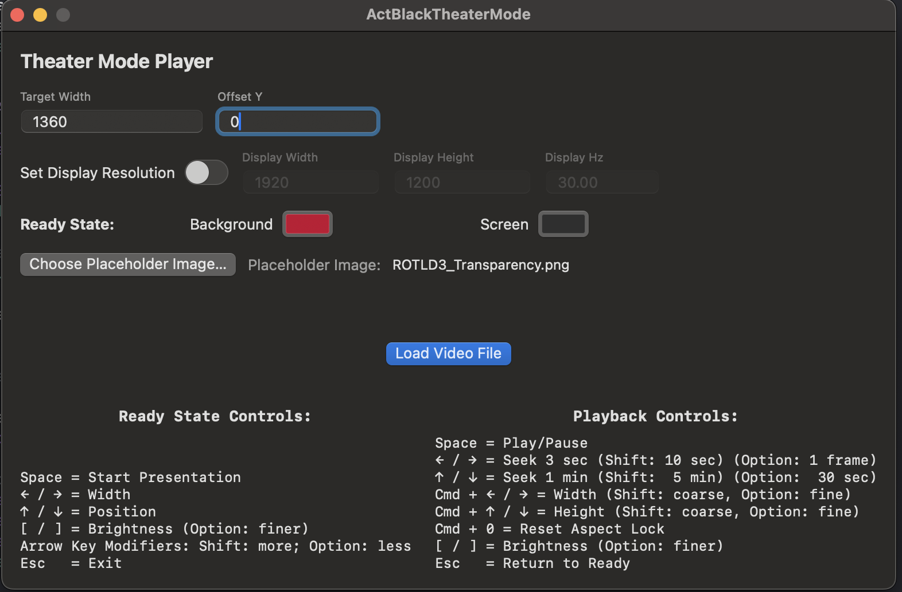
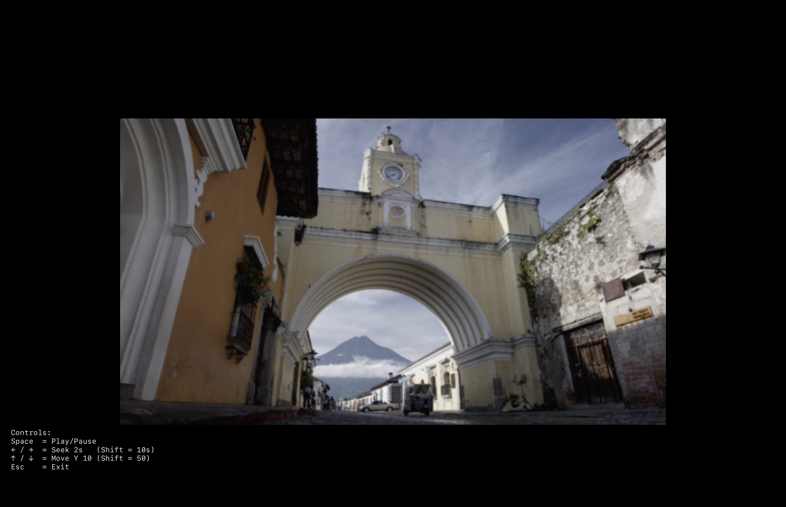

# TheaterModePlayer

A lightweight macOS fullscreen video playback tool designed for museum and gallery environments.

**TheaterModePlayer** presents a selected video in a clean, borderless, black fullscreen window — ideal for projection surfaces and controlled presentation spaces. It allows precise width control and live vertical positioning adjustments.

Built using native macOS frameworks (Swift + AVFoundation).

---

## Features

- Borderless fullscreen playback 
- Solid black background for projection environments
- Adjustable target video width, maintaining aspect ratio
- Live vertical positioning during playback
- Keyboard-based transport controls
- Customizable "ready mode" with animated "house lights down" fade on initial play
- Settings persistence (remembers width, Y offset & ready mode colors)
- Hides mouse in presentation mode
- Automatically prefers external display 
- No runtime dependencies beyond macOS

---

## Playback Controls

During playback:

| Key | Action |
|-----|--------|
| **Space** | Play / Pause |
| **← / →** | Seek ±2 seconds |
| **Shift + ← / →** | Seek ±10 seconds |
| **↑ / ↓** | Adjust vertical position |
| **Shift + ↑ / ↓** | Larger vertical adjustment |
| **Esc** | Exit playback |

If a non-handled key is pressed, an on-screen overlay briefly reappears showing the controls.

---

## How It Works

1. Launch the app.
2. Set the desired **Target Width** and **Offset Y**.
3. Choose a video file.
4. Playback opens fullscreen on the preferred display (external projector if connected).
5. Adjust positioning live if needed.

Settings persist between launches.
