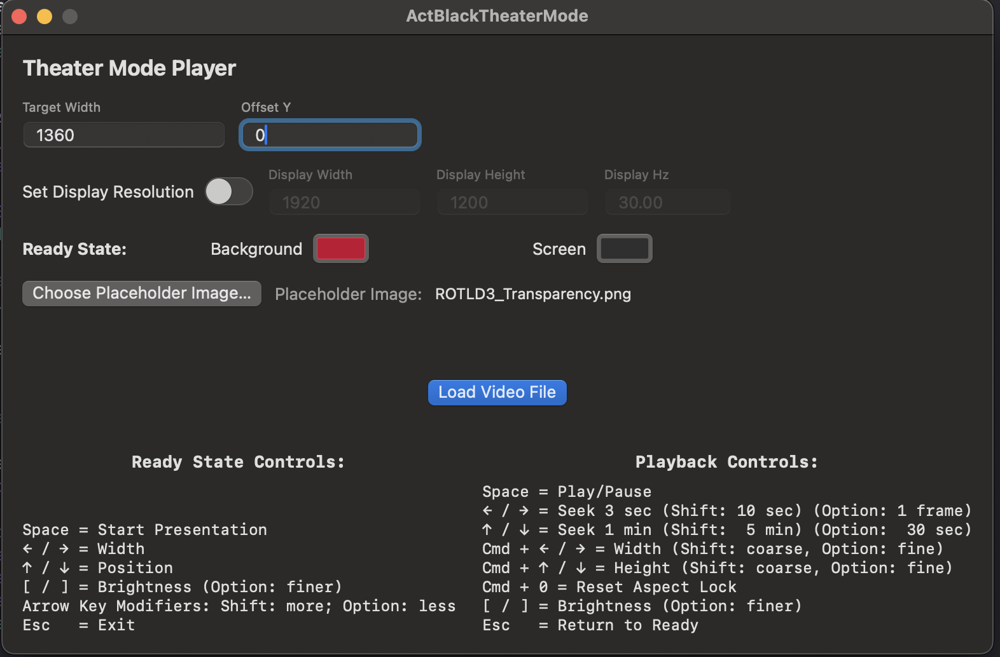

# TheaterModePlayer

A lightweight macOS fullscreen video playback tool designed for museum and gallery environments.

**TheaterModePlayer** presents a selected video in a clean, borderless, black fullscreen window for projection surfaces and controlled presentation spaces. It allows precise width control and live vertical positioning adjustments.

Built using native macOS frameworks (Swift + AVFoundation).

[Download Link](https://www.dropbox.com/scl/fi/n7o7zmzolg763f2v2givg/ActBlackTheaterMode.zip?rlkey=ltx8ngrqpa46lg98hf3ql12kt&st=bxaojaio&dl=0)    

---

## Features

- Borderless fullscreen playback 
- Solid black background for projection environments
- Adjustable target video width, maintaining aspect ratio
- Adjustable playback brightness with immediate visual feedback
- Customizable "Ready State" supporting placeholder imagebackground colors
- Ready State controls to adjust height/width live
- Animated "house lights down" fade on initial play from Ready State
- Keyboard-based transport controls
- Configurable resolution & frame rate on presentation start
- Settings persistence: size, Y offset, brightness, display mode settings, and Ready State colors
- Hides mouse cursor in Presentation Mode
- Automatically prefers external display 
- No runtime dependencies beyond macOS

---

## Controls

In Ready State:

| Key | Ready State Action | Playback Action |
|-----|--------------------|-----------------|
| **Space** | Start Presentation | Play / Pause |
| **← / →** | Player Width Adjustment | Seek ±3 Seconds |
| **Shift + ← / →** | Coarse Width Adjustment | Seek ±10 Seconds |
| **Option + ← / →** | Fine Width Adjustment | Seek by Frame |
| **↑ / ↓** | Player Vertical Position Adjustment | Seek ±1 Minute |
| **Shift + ↑ / ↓** | Coarse Vertical Adjustment | Seek ±5 Minutes |
| **Option + ↑ / ↓** | Fine Vertical Adjustment | Seek ±30 Seconds |
| **Cmd + ← / →** | N/A | Independent Width Resize |
| **Cmd + ↑ / ↓** | N/A | Independent Height Resize |
| **Cmd + 0** | N/A | Re-lock Aspect Ratio |
| **[ / ]** | Brightness Down / Up | Brightness Down / Up |
| **Option + [ / ]** | Fine Brightness Down / Up | Fine Brightness Down / Up |
| **Tab** | Show Controls Overlay | Show Controls Overlay |
| **Esc** | Exit playback | Return to Ready State |

Press `Tab` to show the on-screen controls overlay.

---

## Display Mode Switching

- Enable `Set Display Resolution` to switch the active display mode when presentation starts.
- Configure `Display Width`, `Display Height`, and `Display Hz` in the main window.
- Enter `0` for `Display Hz` to use fallback behavior (highest refresh at that resolution).
- On theater window close (or app quit), the app restores the user's original display mode.
- If the app exits unexpectedly while a switched mode is active, restore is attempted on next launch.

## How It Works

1. Launch the app.
2. Optionally select Ready State placeholder image.
3. Optionally enable display mode switching and set resolution/refresh.
4. Choose a video file.
5. Playback opens fullscreen on the preferred display (external projector if connected).
6. Adjust width, position, and brightness with keyboard controls if needed.
7. Begin presentation by typing SPACE.
8. During playback, SPACE pauses, ESC returns to Ready State, and pressing ESC again exits playback.

Settings persist between launches.

## Steps to Circumvent MacOS Security Block

If you see “The app can’t be opened because it is from an unidentified developer”:

1. Go to System Settings → Privacy & Security.
2. Scroll down.
3. You should see a message about TheaterModePlayer being blocked.
4. Click “Open Anyway”.
5. Confirm.

*Should only be required at first launch
